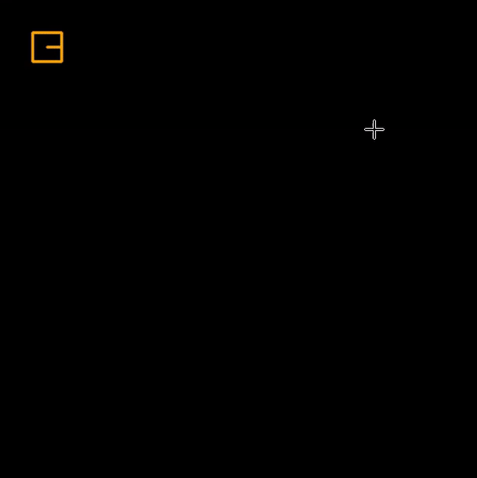
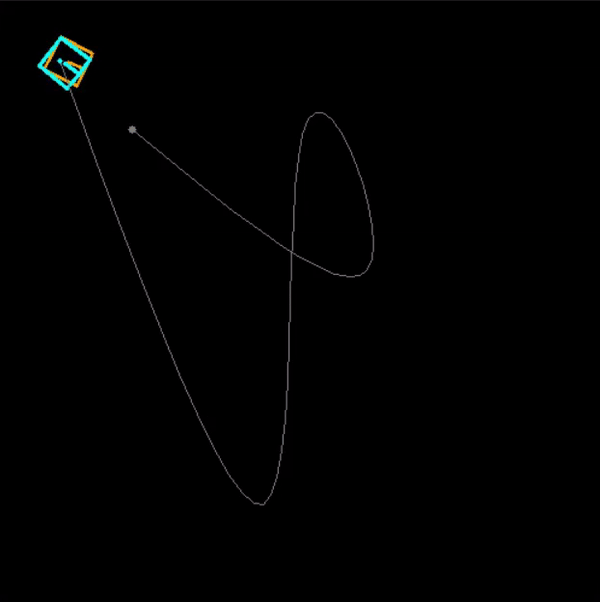
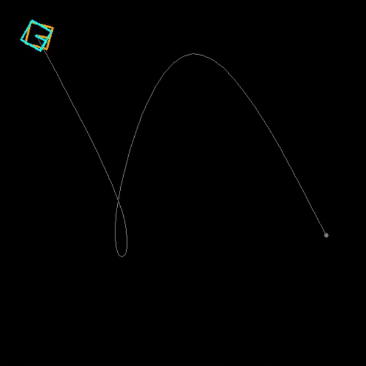

# Differential Drive Robot
A simulation of two wheel differential drive robot. The robot could track a given path with PID controller or model predictive controller. And some tracks have been designed for comparing two different controller.

## Usage
In the basic mode, the robot using PID controller in default. User can use their mouse to add or remove waypoint on the window, and observe the effects of different parameters.
``` shell
python main.py
```
<div style="text-align: center;">
  
</div>

## Comparison
In comparison mode, we can simply observe the behavior of PID control in orange robot and MPC in blue robot. 

<div style="text-align: center;">
  
  
  
</div>
<div style="text-align: center;">
  
  
</div>

