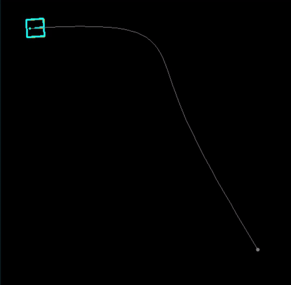

# Differential Drive Robot
A simulation of two wheeled differential drive robot. The robot could simply follow a given waypoints based on PID controller or MPC controller (model predictive controller).

* usage
* example of comparison

User is recommneded to create a virtual environment `.venv` for this project, and make sure all dependencies are installed properly. 

```bash
pip install -r requirements.txt
```

## Usage

The differential wheeled robot is equipped with PID controller in default. You could add waypoint with left mouse and remove exist waypoint with right mouse on the window. The application also provide square and circle path generator, user can selected the generator based on different type option.

``` shell
python main.py --type [square|circle]
```

<div align="center">
  
  
  
</div>

Besides, you can also tuning the parameters of controller right on the main file directly, and observe the difference of behavior under different parameters. It could also help you tuning a proper parameter for the controller.

<div align="center">
  
  
</div>

## Model Predictive Controller
The objective of the model predictive control is to minimize a cost function over a finite prediction horizon (window) $n$. The cost function is mainly compose of three terms:
1. **state cost**: to penalize deviation of robot's state from target
2. **input cost**: to penalize large control input
3. **input difference cost**: encourage smooth control inputs by penalizing large difference between consecutive control inputs

Thus, the cost function to minimize is:

$$
\mathcal J(u_k)=\sum_{k=0}^{n-1}\Big((x_k-t)^TQ(x_k-t)+u_k^TRu_k+(u_{k+1}-u_k)^TR_d(u_{k+1}-u_k) \Big)
$$

where:
* $t$ is taget
* $x_k$ and $u_k$ is the robot state and control input at step $k$
* $Q, R$ and $R_d$ are positive definite matrices representing the weight matrices for state error, control input and control input difference cost respectively 

<br/>

The optimization is subject to input constraints, which are bounds on the control inputs

$$
v_{\  min}\leq v_k\leq v_{\max}, w_{\min}\leq w_k\leq w_{\max}
$$

where $v_k$ is the linear velocity and $w_k$ is the angular velocity at time step $k$.


## Examples

In example, it has several of maps that could be used in comparison of different controller. Here's some results of comparison, with **orange** robot in PID controller and **blue** robot is MPC controller.

```bash
python example.py --map map/maps/map00.txt
```

<div align="center">
  
  
  
</div>
<div align="center">
  
  
  
</div>

The pipeline object of each controller in the example has the method to return the trajectory of x and y coordinates, a history of error to the distance and the time series.

```python
x, y, error, interval = pipeline.extract_history()
```

User can modify the contents to save the history or plot the trajectory and error like figure below to analysis different controller or different parameter if needed.

<div align="center">
  
</div>

Some different maps are provided in this project, please see [here](./map/) for more kind of choice and information. You can also generate your own one for development or testing.


## References
* [differential drive robot](https://en.wikipedia.org/wiki/Differential_wheeled_robot)
* [model predictive control](https://en.wikipedia.org/wiki/Model_predictive_control)

