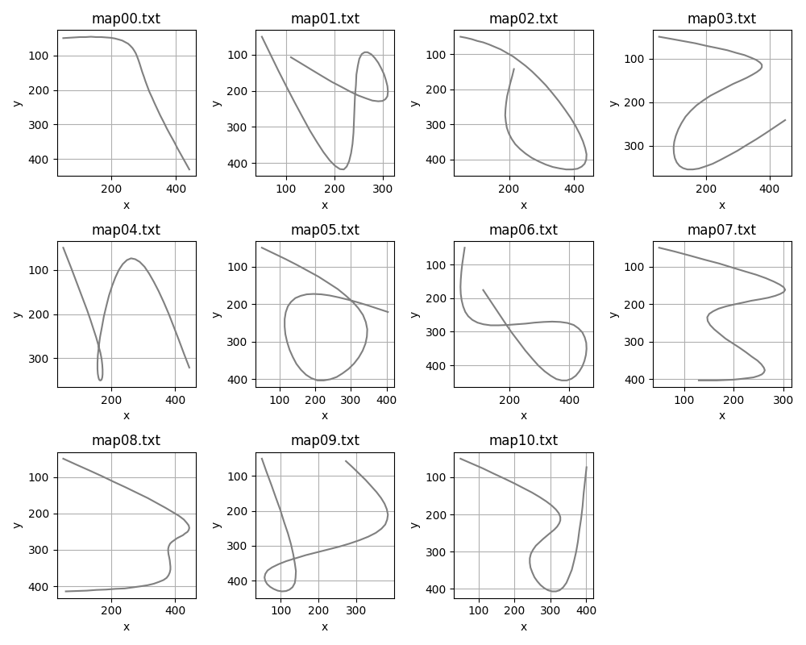

# Map Generator and Loader
This folder provides functions for generating waypoints in square or circular shape, and loading waypoints from a text file.

## Functions
`square_path_generator` used to generate a square-shaped path with waypoints at defined intervals, and `circle_path_generator` used to generate a circle-shaped path with waypoints evenly distributed along the circumference.

```python
waypoints = square_path_generator(x=0, y=0, b=20, step=5)
```

Notes that the x and y coordinate in `square_path_generator` is the initial position, but the cooresponding coordinate in `circle_path_generator` is the center of the circular waypoints. Make sure the robot are initialized in the correct initial position.

User can also apply the `load_map` function to loads waypoints from a file. Each line in the file should contain coordinates in the format

```python
waypoints = load_map("map.txt")
```

## Examples
There are some examples have been generated for the comparison in different controller. User could also apply the `load_map` function to load the text files from the `maps` folder, and run the tracking mission with specific needed.


